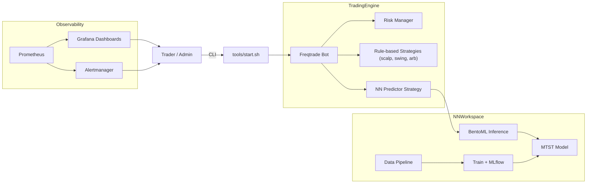

# Crypto Trading Bot

Минималистичный каркас для торгового бота, поддерживающего rule-based стратегии и нейросетевые модули. Инфраструктура включает Prometheus и Grafana для мониторинга, а также готова к быстрой разработке и тестированию.

## Архитектура

Ниже представлена общая схема работы бота и взаимодействия его основных компонентов.



Основные компоненты системы:

*   **TradingEngine**: Отвечает за исполнение торговых операций.
    *   **Freqtrade Bot**: Основной торговый движок.
    *   **Risk Manager**: Модуль управления рисками.
    *   **Rule-based Strategies**: Традиционные стратегии, основанные на правилах (например, scalp, swing, arbitrage).
    *   **NN Predictor Strategy**: Стратегия, использующая предсказания нейронной сети.
*   **NNWorkspace**: Среда для разработки, обучения и развертывания моделей машинного обучения.
    *   **Data Pipeline**: Конвейер для сбора, обработки и подготовки данных для обучения моделей.
    *   **MTST Model**: Определение (архитектура) модели нейронной сети (например, многомерные временные ряды).
    *   **Train + MLflow**: Процесс обучения модели с логированием экспериментов и артефактов в MLflow.
    *   **BentoML Inference**: Сервис для развертывания обученной модели и предоставления API для получения предсказаний.
*   **Observability**: Компоненты для мониторинга и оповещения.
    *   **Prometheus**: Сбор метрик.
    *   **Grafana Dashboards**: Визуализация метрик.
    *   **Alertmanager**: Система оповещений.

Более подробное описание компонентов и их взаимодействия смотрите в [docs/architecture.md](docs/architecture.md).

## Структура каталогов

- `conf/` — конфигурационные файлы.
- `strategies/` — rule-based стратегии.
- `nn/` — модули нейросети.
- `tools/` — вспомогательные скрипты.

## Настройка окружения

В корне проекта находится файл `.env.example` с перечнем переменных окружения.
Скопируйте его в `.env` и заполните требуемые значения:
- `docs/` — документация по архитектуре и модулям.

Дополнительные сведения о подключении риск‑менеджера см. в [docs/risk_manager.md](docs/risk_manager.md).

## Требования

- Docker и `docker-compose` для запуска инфраструктуры.
- Python 3.10+ для обучения и запуска сервиса инференса.

## Переменные окружения

Скопируйте `.env.example` в `.env` и заполните API‑ключи бирж:
 main

```bash
cp .env.example .env
```

### Переменные

- `BINANCE_KEY` и `BINANCE_SECRET` — ключи API для работы с Binance в реальном режиме.
- `BINANCE_TEST_KEY` и `BINANCE_TEST_SECRET` — ключи API Binance для тестовой сети.
- `BYBIT_KEY` и `BYBIT_SECRET` — ключи API Bybit для реальной торговли.
- `BYBIT_TEST_KEY` и `BYBIT_TEST_SECRET` — ключи API Bybit для тестового режима.
- `OKX_KEY` и `OKX_SECRET` — ключи API OKX для реальной торговли.
- `OKX_TEST_KEY` и `OKX_TEST_SECRET` — ключи API OKX для тестовой среды.
- `GLASSNODE_API_KEY` — ключ API для Glassnode, используется для загрузки ончейн-метрик в `tools/backfill.py` (опционально).

Указывайте только те ключи, которые соответствуют используемым биржам и режимам работы.
=======
Переменные вида `BINANCE_KEY`, `BYBIT_SECRET` и другие используются скриптами и
в Docker‑контейнерах.

## Запуск бота через `docker-compose`

Поднимите инфраструктуру:

```bash
docker-compose up -d
```

Далее запустите бота с нужными параметрами, например для Binance в тестовом
режиме:

```bash
./tools/start.sh binance test
```

Скрипт объединит базовую конфигурацию с файлом `conf/binance.test.json` и
запустит контейнер `freqtrade`.

## Обучение нейросети

```bash
cd nn
pip install -r requirements.txt
python train.py --features path/to/features.parquet --epochs 20
```

Модель сохраняется в каталог `nn/` и регистрируется в MLflow.

## Запуск сервиса инференса

После обучения модели можно запустить BentoML‑сервис:

```bash
docker-compose up -d nn_infer
```

Он будет доступен на порту `3000` и использует модель с алиасом `prod` из
реестра BentoML.
=======
## Запуск через Docker Compose

```bash
docker compose up -d
```

Команда поднимет контейнеры бота, сервис нейросети, Prometheus и Grafana. При необходимости перед запуском можно выполнить `docker compose build`.

## Скрипт `tools/start.sh`

Скрипт собирает конфигурацию из `conf/base.json` и `<exchange>.<mode>.json`, после чего стартует Freqtrade. Примеры:

```bash
./tools/start.sh binance live  # запуск в боевом режиме
./tools/start.sh bybit test    # dry-run на тестовой бирже
```

## Конвейер данных, обучение нейросети и сервис инференса

Процесс подготовки данных, обучения модели и запуска сервиса предсказаний выглядит следующим образом:

1.  **Сбор данных**:
    *   Исторические данные (OHLCV, ставки финансирования) загружаются с помощью скрипта `tools/backfill.py`. Например, для загрузки часовых данных BTC/USDT с Binance за период с 1 января 2023 года:
        ```bash
        python tools/backfill.py binance BTC/USDT 2023-01-01 1h
        ```
    *   Данные сохраняются в каталог `data/raw/<exchange>/<pair>/<timeframe>/`.

2.  **Обогащение данных (опционально)**:
    *   Если установлен ключ `GLASSNODE_API_KEY` в файле `.env`, скрипт `tools/backfill.py` также попытается загрузить ончейн-метрики с Glassnode и объединить их с историческими данными биржи с помощью функции `enrich_onchain` из `nn/data_pipeline.py`.

3.  **Инженерия признаков**:
    *   Скрипт `nn/data_pipeline.py` содержит функцию `make_features`, которая генерирует признаки для обучения модели на основе загруженных и обогащенных данных.
    *   Обработанные данные с признаками сохраняются, например, в `data/features/<exchange>/<pair>/<timeframe>/features.parquet`.

4.  **Обучение модели**:
    *   Скрипт `nn/train.py` использует сгенерированные признаки для обучения нейросетевой модели. Пример запуска:
        ```bash
        python nn/train.py --features data/features/binance/BTC_USDT/1h/features.parquet --epochs 20
        ```
    *   В процессе обучения эксперименты логируются в MLflow (локально в каталоге `mlruns`), а обученная модель версионируется и сохраняется. Модель и лог MLflow также сохраняются в каталоге `nn/`.

5.  **Запуск сервиса инференса**:
    *   Обученная модель используется для предсказаний с помощью сервиса `nn/infer_service.py` (основанного на BentoML). Сервис запускается через Docker Compose:
        ```bash
        docker compose up -d nn_infer
        ```
    *   Этот сервис предоставляет HTTP API для получения предсказаний от модели (например, для использования в стратегии `NN Predictor Strategy` в Freqtrade). Он будет доступен на порту `3000`.
    *   Проверить доступность сервиса можно, открыв в браузере `http://localhost:3000` или выполнив команду:
        ```bash
        curl http://localhost:3000/livez
        ```
    *   Для получения предсказаний (пример структуры запроса, реальные данные могут отличаться):
        ```bash
        curl -X POST -H "Content-Type: application/json" -d '[[0.1, 0.2, ..., 0.5]]' http://localhost:3000/predict
        ```
=======
## Running tests

Install development dependencies and execute pytest:

```bash
pytest
```

## Кодстайл и Линтинг

В проекте настроены pre-commit хуки для автоматической проверки и форматирования кода.
Это помогает поддерживать единый стиль кода и выявлять потенциальные ошибки на ранней стадии.

### Первоначальная настройка

1.  Установите зависимости для разработки:
    ```bash
    pip install -r requirements-dev.txt
    ```
2.  Установите pre-commit хуки в ваш локальный git репозиторий:
    ```bash
    pre-commit install
    ```

После этого хуки будут автоматически запускаться перед каждым коммитом.

### Ручной запуск

Вы также можете запустить все хуки для всех файлов вручную:
```bash
pre-commit run --all-files
```
Это может быть полезно для первоначальной проверки всего проекта или после обновления конфигурации хуков.

## Workflow c помощью Makefile

Для упрощения стандартных операций разработки и запуска в проекте предусмотрен `Makefile`.
Он предоставляет набор команд для выполнения частых задач.

Чтобы увидеть все доступные команды и их описание, выполните:
```bash
make
```
или
```bash
make help
```

### Основные команды:

*   `make setup`: Установка зависимостей для разработки и pre-commit хуков.
*   `make lint`: Запуск линтеров и форматировщиков кода.
*   `make test`: Запуск юнит-тестов.
*   `make train FEATURES=... EPOCHS=...`: Запуск обучения нейросети (не забудьте указать путь к файлу с признаками).
*   `make backfill EXCHANGE=... SYMBOL=... START_DATE=... TF=...`: Запуск скрипта для скачивания данных.
*   `make docker-up`: Сборка и запуск всех сервисов через docker-compose.
*   `make docker-down`: Остановка всех сервисов, запущенных через docker-compose.
*   `make clean`: Удаление временных файлов.

Перед использованием `make train` или `make backfill` убедитесь, что вы указали корректные параметры, если стандартные значения вам не подходят.
 main
