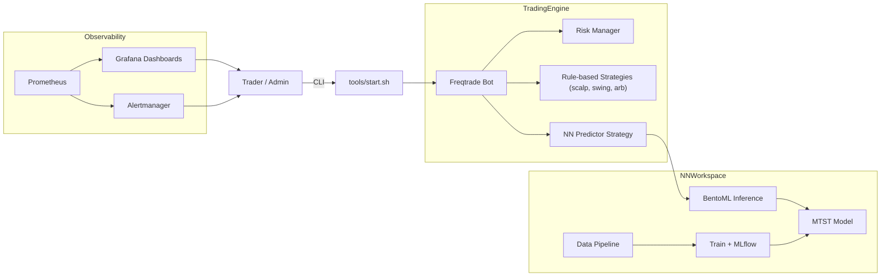

# Архитектура системы

```mermaid
graph LR
    subgraph TradingEngine
        Freqtrade["Freqtrade Bot"]
        RiskManager["Risk Manager"]
        Strategies["Rule-based Strategies (scalp, swing, arb)"]
        NNStrategy["NN Predictor Strategy"]
    end
    subgraph NNWorkspace
        DataPipeline["Data Pipeline"]
        ModelDef["MTST Model"]
        Train["Train + MLflow"]
        InferService["BentoML Inference"]
    end
    subgraph Observability
        Prom["Prometheus"]
        Grafana["Grafana Dashboards"]
        Alertman["Alertmanager"]
    end
    User["Trader / Admin"] -->|CLI| StartScript["tools/start.sh"]
    StartScript --> Freqtrade
    Freqtrade --> Strategies
    Freqtrade --> RiskManager
    Freqtrade --> NNStrategy
    NNStrategy --> InferService
    InferService --> ModelDef
    Train --> ModelDef
    DataPipeline --> Train
    Prom --> Grafana
    Grafana --> User
    Prom --> Alertman
    Alertman --> User
```
