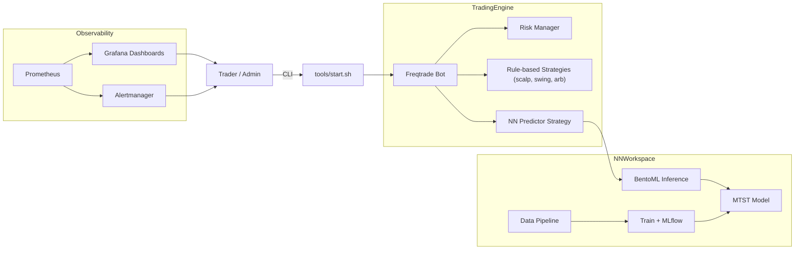

# Архитектура системы

Ниже представлена общая схема работы бота и взаимодействия его основных
компонентов.


=======
 codex/extend-architecture.md-with-components-description
flowchart TD
    DP[data_pipeline] --> TR[train]
    TR --> ML[MLflow]
    ML --> BM[BentoML]
    BM --> FT[Freqtrade]
```

## Описание компонентов

**data_pipeline** – отвечает за загрузку и подготовку исторических данных. Здесь
проводится очистка и сохранение котировок в формате, пригодном для обучения.

**train** – использует подготовленные данные для обучения моделей и стратегий.
Результаты экспериментов передаются в MLflow.

**MLflow** – система отслеживания метрик и параметров. Позволяет вести журнал
экспериментов и выбирать наилучшие модели.

**BentoML** – упаковывает выбранную модель, предоставляя REST API для
инференса. Это облегчает развёртывание внутри бота.

**Freqtrade** – торговый движок, который запускает стратегии и взаимодействует с
биржей. Он обращается к BentoML за предсказаниями и исполняет сделки.
=======
flowchart LR
    A[data_pipeline] --> B[train]
    B --> C[MLflow]
    C --> D[BentoML]
    D --> E[Freqtrade]
```

Данные последовательно проходят через несколько этапов. Сначала
`data_pipeline` готовит входные данные, которые затем используются на
стадии `train` для обучения моделей. Результаты и метрики экспериментов
фиксируются в `MLflow`. После этого модели упаковываются и
развёртываются через `BentoML`, а готовые артефакты применяются в
торговом движке `Freqtrade`.
main
