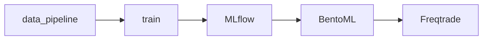

# Архитектура системы

Данные последовательно проходят через несколько этапов. Сначала
`data_pipeline` готовит входные данные, которые затем используются на
стадии `train` для обучения моделей. Результаты и метрики экспериментов
фиксируются в `MLflow`. После этого модели упаковываются и
развёртываются через `BentoML`, а готовые артефакты применяются в
торговом движке `Freqtrade`.
