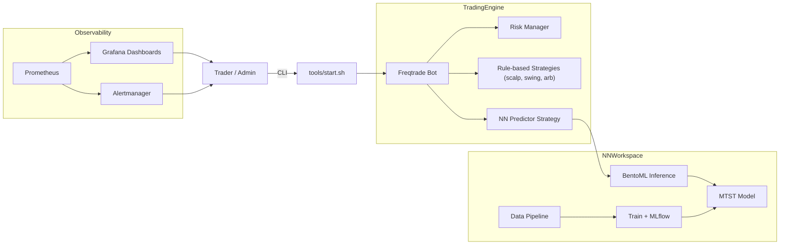

# Архитектура системы

Ниже представлена общая схема работы бота и взаимодействия его основных
компонентов.

## Описание компонентов

Эта секция предоставляет более детальное описание каждого компонента, показанного на диаграмме выше.

### TradingEngine

Основной модуль, отвечающий за непосредственное выполнение торговых операций, управление стратегиями и рисками.

#### Freqtrade Bot
*   Центральный элемент торгового движка. Freqtrade - это open-source бот для торговли криптовалютами.
*   Отвечает за:
    *   Подключение к биржам.
    *   Получение рыночных данных (цены, объемы).
    *   Исполнение ордеров (покупка/продажа).
    *   Управление активными сделками.
    *   Ведение истории сделок.
    *   Предоставление API для пользовательских стратегий.
*   Взаимодействует с `Risk Manager`, `Rule-based Strategies` и `NN Predictor Strategy`.

#### Risk Manager
*   Модуль, предназначенный для контроля и управления рисками.
*   Задачи:
    *   Определение максимального размера позиции.
    *   Управление стоп-лоссами и тейк-профитами на уровне портфеля.
    *   Мониторинг общего риска по всем активным позициям.
    *   Может временно приостанавливать торговлю при достижении определенных лимитов убытков или волатильности рынка.
*   Интегрируется с Freqtrade для применения правил риска к сделкам.

#### Rule-based Strategies (scalp, swing, arb)
*   Традиционные торговые стратегии, основанные на заранее определенных правилах и технических индикаторах.
*   Примеры:
    *   **Scalping**: Краткосрочные стратегии, нацеленные на получение небольшой прибыли от множества сделок.
    *   **Swing Trading**: Среднесрочные стратегии, удерживающие позиции от нескольких дней до недель, чтобы заработать на "свингах" (колебаниях) цены.
    *   **Arbitrage**: Стратегии, использующие разницу в ценах на один и тот же актив на разных биржах или в разных парах.
*   Реализуются как пользовательские стратегии в Freqtrade.

#### NN Predictor Strategy
*   Специализированная стратегия Freqtrade, которая интегрируется с сервисом инференса нейронной сети (`InferService`).
*   Получает предсказания от модели (например, направление движения цены или вероятность определенного события).
*   На основе этих предсказаний генерирует торговые сигналы (покупка/продажа).
*   Может комбинировать предсказания нейросети с традиционными техническими индикаторами или правилами.

### NNWorkspace

Пространство, посвященное всем аспектам работы с нейронными сетями: от сбора данных до обучения моделей и их последующего развертывания для использования в реальном времени.

#### Data Pipeline
*   Конвейер данных, автоматизирующий сбор, очистку, преобразование и хранение данных, необходимых для обучения моделей.
*   Этапы:
    *   **Сбор данных**: Загрузка исторических данных (OHLCV, объемы, ставки финансирования и т.д.) с бирж (`tools/backfill.py`).
    *   **Обогащение данных**: Добавление дополнительных данных, например, ончейн-метрик с Glassnode (`enrich_onchain` в `nn/data_pipeline.py`), если настроено.
    *   **Инженерия признаков**: Создание новых признаков из существующих данных, которые могут улучшить производительность модели (`make_features` в `nn/data_pipeline.py`).
    *   **Хранение**: Сохранение обработанных данных в форматах, удобных для обучения (например, Parquet) в каталогах `data/raw/` и `data/features/`.

#### MTST Model (Multivariate Time Series Transformer)
*   Обозначает архитектуру или тип модели машинного обучения, используемой для предсказаний. В данном контексте, это может быть модель, основанная на трансформерах, для анализа многомерных временных рядов.
*   Определение модели, ее слоев, параметров и т.д., находится в кодовой базе нейросетевого модуля (`nn/`).

#### Train + MLflow
*   Процесс обучения выбранной модели (`MTST Model`) на подготовленных данных из `Data Pipeline`.
*   Скрипт `nn/train.py` управляет циклом обучения.
*   **MLflow** используется для:
    *   **Трекинга экспериментов**: Запись параметров, метрик (например, точность, потери), артефактов (например, сериализованные модели, графики) каждого запуска обучения.
    *   **Версионирования моделей**: Регистрация обученных моделей в реестре MLflow, что позволяет отслеживать различные версии и выбирать лучшие для развертывания.
    *   Локально данные MLflow сохраняются в каталоге `mlruns`.

#### BentoML Inference Service
*   Сервис, отвечающий за развертывание обученной и версионированной модели из MLflow для предоставления предсказаний по запросу.
*   Использует **BentoML** для:
    *   Упаковки модели и ее зависимостей в готовый к развертыванию формат (Bento).
    *   Создания стандартизированного API (обычно HTTP/REST) для получения предсказаний от модели.
    *   Обеспечения возможности масштабирования и управления развернутыми моделями.
*   Сервис (`nn/infer_service.py`) запускается в Docker-контейнере (`nn_infer`) и доступен для `NN Predictor Strategy`.

### Observability

Набор инструментов и практик для мониторинга состояния системы, сбора метрик, визуализации данных и настройки оповещений о критических событиях.

#### Prometheus
*   Система мониторинга и временных рядов с открытым исходным кодом.
*   Собирает метрики с различных компонентов системы (Freqtrade, NN Infer Service, системные метрики) по принципу pull-модели через HTTP эндпоинты.
*   Хранит метрики в базе данных временных рядов.
*   Предоставляет язык запросов PromQL для анализа метрик.

#### Grafana Dashboards
*   Платформа для визуализации и анализа данных с открытым исходным кодом.
*   Подключается к Prometheus как к источнику данных.
*   Позволяет создавать интерактивные дашборды для отображения метрик в виде графиков, таблиц, индикаторов и т.д.
*   Используется для визуального мониторинга производительности и состояния торгового бота и связанных сервисов.

#### Alertmanager
*   Компонент Prometheus, отвечающий за обработку и отправку оповещений.
*   Получает правила оповещений от Prometheus.
*   Дедуплицирует, группирует и маршрутирует оповещения различным получателям (например, email, Slack, PagerDuty).
*   Позволяет настроить оповещения о нештатных ситуациях, таких как сбои в работе бота, проблемы с сервисом инференса, или аномальное рыночное поведение.

### User Interaction

#### Trader / Admin
*   Пользователь системы, который взаимодействует с ней для настройки, запуска, мониторинга и управления.

#### StartScript (`tools/start.sh`)
*   CLI-инструмент (скрипт командной строки), который упрощает запуск и конфигурацию Freqtrade, объединяя базовые и специфичные для биржи/режима конфигурационные файлы.
