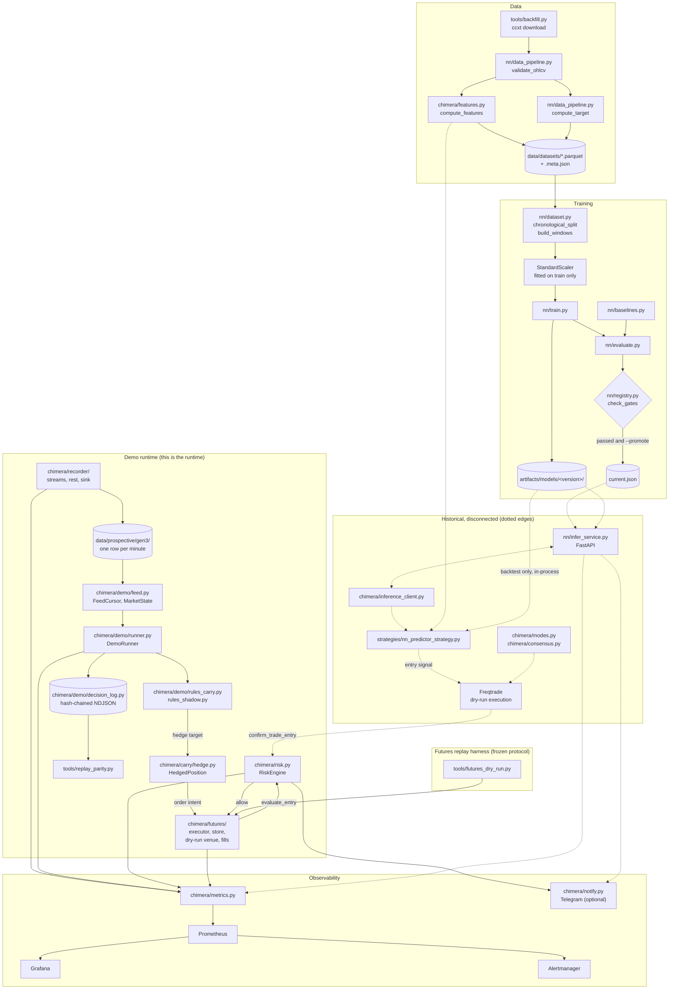

# Architecture

This describes the code as it is, not as it is intended to become. Two paths
are described below and they are not equals: the **demo path** is the runtime,
and the Freqtrade path is retired and disconnected. Where a section covers the
retired path it says so in its heading, and it is written in the past tense on
purpose.

## Boundaries

The runtime has no exchange-facing execution engine at all: it reads market data
a recorder captured and simulates fills. One retired Freqtrade path remains in
the tree, disconnected — see [Historical, disconnected](#historical-disconnected).
Within the runtime, a strict rule about who may do what:

- **ML code never places orders.** Nothing under `nn/` imports an exchange
  client for trading, opens a position, or manages one. The inference service's
  only output is a probability vector.
- **The recorder computes nothing.** `chimera/recorder/` carries exchange-
  published values across unchanged. No return, no signal, no basis, no PnL. A
  minute it holds no usable closed kline for has no row, and no value is
  interpolated, forward-filled or borrowed from a neighbouring minute.
- **A rule sees a `MarketState` and nothing else.** No rule module imports an
  executor, a venue, a position or the feed, and a shadow rule returns a
  `SignalOnly`, which no position can accept — the guarantee is in the type
  signature rather than in a comparison. `tests/test_demo_no_live_path.py`
  asserts both over the AST.
- **Every entry passes the risk engine.** `RiskEngine.evaluate_entry` is the
  single gate: the dry-run futures executor asks it before any order that
  increases exposure, and `chimera/carry/hedge.py` is the only translator from a
  rule's decision into an order intent. It is a synchronous local check — no
  network call stands between a halted account and a blocked order.
- **The runtime cannot reach the retired layers.**
  `tests/test_retired_runtime_disconnected.py` walks the import closure of
  `chimera.demo`, `chimera.carry` and every active CLI and asserts it contains
  none of `strategies`, `tools.run_bot`, `nn.infer_service`, `nn.registry`,
  `chimera.inference_client`, `chimera.modes`, `chimera.consensus` or
  `freqtrade`. Reachability is a claim about the import graph, so it is asserted
  over the graph rather than by importing anything.
- **`chimera/` never imports torch or freqtrade.** It is loaded in every
  container, so it stays light enough to be.

## Flow

```mermaid
flowchart TD
    subgraph Data
        BF["tools/backfill.py<br/>ccxt download"]
        VAL["nn/data_pipeline.py<br/>validate_ohlcv"]
        FEAT["chimera/features.py<br/>compute_features"]
        TGT["nn/data_pipeline.py<br/>compute_target"]
        DS[("data/datasets/*.parquet<br/>+ .meta.json")]
    end

    subgraph Training
        SPLIT["nn/dataset.py<br/>chronological_split<br/>build_windows"]
        SCALE["StandardScaler<br/>fitted on train only"]
        TRAIN["nn/train.py"]
        BASE["nn/baselines.py"]
        EVAL["nn/evaluate.py"]
        GATE{"nn/registry.py<br/>check_gates"}
        ART[("artifacts/models/&lt;version&gt;/")]
        CUR[("current.json")]
    end

    subgraph DemoRuntime["Demo runtime (this is the runtime)"]
        REC["chimera/recorder/<br/>streams, rest, sink"]
        NORM[("data/prospective/gen3/<br/>one row per minute")]
        FEED["chimera/demo/feed.py<br/>FeedCursor, MarketState"]
        RUN["chimera/demo/runner.py<br/>DemoRunner"]
        RULE["chimera/demo/rules_carry.py<br/>rules_shadow.py"]
        RISK["chimera/risk.py<br/>RiskEngine"]
        HEDGE["chimera/carry/hedge.py<br/>HedgedPosition"]
        FUT["chimera/futures/<br/>executor, store,<br/>dry-run venue, fills"]
        LOG[("chimera/demo/decision_log.py<br/>hash-chained NDJSON")]
        PARITY["tools/replay_parity.py"]
    end

    subgraph Historical["Historical, disconnected (dotted edges)"]
        SVC["nn/infer_service.py<br/>FastAPI"]
        CLIENT["chimera/inference_client.py"]
        STRAT["strategies/nn_predictor_strategy.py"]
        FT["Freqtrade<br/>dry-run execution"]
        MODES["chimera/modes.py<br/>chimera/consensus.py"]
    end

    subgraph FuturesDryRun["Futures replay harness (frozen protocol)"]
        HARN["tools/futures_dry_run.py"]
    end

    subgraph Observability
        MET["chimera/metrics.py"]
        PROM["Prometheus"]
        GRAF["Grafana"]
        ALERT["Alertmanager"]
        TG["chimera/notify.py<br/>Telegram (optional)"]
    end

    BF --> VAL --> FEAT --> DS
    VAL --> TGT --> DS
    DS --> SPLIT --> SCALE --> TRAIN
    TRAIN --> EVAL
    BASE --> EVAL
    EVAL --> GATE
    TRAIN --> ART
    GATE -->|passed and --promote| CUR
    REC --> NORM --> FEED --> RUN
    RUN --> RULE
    RULE -->|hedge target| HEDGE
    HEDGE -->|order intent| FUT
    FUT -->|evaluate_entry| RISK
    RISK -->|allow| FUT
    RUN --> LOG
    LOG --> PARITY
    HARN --> FUT
    CUR -.-> SVC
    ART -.-> SVC
    SVC <-.-> CLIENT
    CLIENT -.-> STRAT
    FEAT -.-> STRAT
    ART -.->|backtest only, in-process| STRAT
    STRAT -.->|entry signal| FT
    FT -.->|confirm_trade_entry| RISK
    MODES -.-> FT
    REC --> MET
    RUN --> MET
    RISK --> MET
    FUT --> MET
    SVC -.-> MET
    MET --> PROM --> GRAF
    PROM --> ALERT
    RISK --> TG
    SVC -.-> TG
```

## Components

### `chimera/` — the shared core

Imported by every other package and by every container. Contains no heavy
dependencies on purpose.

| Module | Responsibility |
| --- | --- |
| `features.py` | The definition of a feature vector. Causal, deterministic, fixed column order. |
| `contracts.py` | `Signal`, `TargetSpec`, `ModelMetadata`, and `decide()`. The shared vocabulary. |
| `risk.py` | `RiskEngine`: limits, sizing, kill switch. No Freqtrade dependency. |
| `safety.py` | The live-trading gate and environment validation. |
| `inference_client.py` | **Historical, disconnected.** HTTP client with caching and fail-closed semantics. |
| `metrics.py` | Every Prometheus series the system exports. |
| `notify.py` | Optional Telegram, deduplicated and rate limited. |
| `modes.py`, `consensus.py` | **Historical, disconnected.** The trading-mode states and the cross-timeframe consensus rule. Still imported by the frozen-evidence tests, and by nothing on the runtime path. |
| `recorder/` | The prospective recorder: contract, event parsers, append-only sink, minute normalizer, live streams and REST pollers. Computes nothing. |
| `demo/` | The demo runtime: runner clock, campaign config, feed cursor, rules, the state machine, and the hash-chained decision log. |
| `carry/` | The two-leg carry position: the ported accounting, the ledger, the hedged position, and the one factory permitted to construct a venue. |
| `futures/` | Dry-run USD-M perpetual execution: positions, order state machine, venue constraints, fees and funding. |

`features.py` being shared is the load-bearing decision: the training pipeline
and the live strategy call the *same function*, so a model cannot be served
inputs computed differently than the ones it learned from.

`futures/` is dry-run only. There is no live-order path:
`FuturesExecutionConfig(dry_run=False)` raises, and the only venue class in the
package simulates fills in this process. Every order it plans that increases
exposure passes `RiskEngine.evaluate_entry` first, so the boundary above holds
for it unchanged. `chimera/carry/hedge.py` drives it on the runtime path, and
`tools/futures_dry_run.py` exercises the frozen validation protocol against it.
Nothing in `strategies/` is wired to it, and `strategies/` is itself
disconnected. The design, and the reasons for it, are in
[`futures_execution_v1.md`](futures_execution_v1.md).

### `nn/` — data, model, training, serving

| Module | Responsibility |
| --- | --- |
| `data_pipeline.py` | Download, validate, label, assemble and persist datasets. |
| `dataset.py` | Chronological splits, windowing, scaling. Where leakage is prevented. |
| `model_def.py` | `MTST`: a small configurable Transformer classifier. |
| `baselines.py` | Majority-class and momentum baselines the model must beat. |
| `train.py` | The training entrypoint. |
| `evaluate.py` | Classification and trading metrics; threshold selection. |
| `experiment.py` | Predeclared config grids, scored on validation only. |
| `walkforward.py` | Nested walk-forward *validation*: train -> inner validation (selection) -> outer validation (reported). |
| `wf_diagnostics.py` | Audits and compares completed walk-forward artifacts: integrity, comparability, seed stability. |
| `regime.py` | Dataset-backed statistics over an outer block's *scored* rows, timestamp-aligned raw OHLCV, and LONG/SHORT attribution. |
| `registry.py` | Artifact save/load, promotion gates, `current.json`. Still what `train.py` writes through; **disconnected** from the runtime, which reads no model. |
| `infer_service.py` | **Historical, disconnected.** The FastAPI service. |

## Historical, disconnected

This was the trading path, and it is not any longer. Disconnected at stage S3:
`strategies/`, `tools/run_bot.py`, `nn/infer_service.py`, `nn/registry.py`'s
serving side, `chimera/inference_client.py`, `chimera/modes.py`,
`chimera/consensus.py`, the two Dockerfiles, the six `conf/<exchange>.<mode>.json`
profiles, and Freqtrade itself.

What disconnection means here is exact, and it is smaller than deletion. Every
one of those files is still in the tree, still has its tests, and still passes
them. What changed is reachability: their module docstrings say `HISTORICAL`,
the `freqtrade` and `nn_infer` compose services carry `profiles: ["legacy"]` so
`docker compose up` does not start them, their Prometheus scrape jobs and rule
file are unloaded (`conf/alerts.yml` stays on disk and stays tested), the
Freqtrade schema job and the image build job run only when someone asks for
them, and the import closure of the runtime contains none of them.

The one honest exception is `make smoke`, which still walks the research
pipeline through `nn.registry` and `nn.infer_service` end to end on every push.
That is deliberate: it is the coverage those two modules have, and taking it
away would weaken the tree in exchange for a tidier claim. So "disconnected"
means "not reachable from the runtime", and not "no longer executed anywhere".

Deletion is a separate, later, reviewable change after the soak stage. Nothing
here was deleted.

### `strategies/` — Freqtrade (historical, disconnected)

`RiskAwareStrategy` (in `strategies/common/risk_manager.py`) is the base class.
It bound the risk engine to four Freqtrade callbacks, verified against the
installed version:

| Callback | What it does |
| --- | --- |
| `bot_loop_start` | Reads equity, updates drawdown and daily-loss state, publishes metrics. |
| `custom_stake_amount` | Risk-based sizing from the stop distance. |
| `confirm_trade_entry` | **The gate.** Returns False to block the order. |
| `order_filled` | Tracks exposure, loss streaks and the order rate. |

## Design decisions and why

### FastAPI instead of BentoML

The previous service loaded its model at import time from the BentoML store, so
the module could not be imported — or tested — without a populated store, and it
introduced a third model-versioning system alongside MLflow and the on-disk
artifacts. FastAPI and Pydantic are already in Freqtrade's dependency tree, give
schema validation and correct status codes directly, and let the entire contract
be exercised with `TestClient` against a tiny model. BentoML was not removed for
being disliked; it was removed because it made the service untestable and added a
redundant registry.

### The artifact directory, not a tracking server

`artifacts/models/<version>/` is the source of truth. A model loads with torch
and the standard library alone, so inference never depends on MLflow being
reachable. MLflow logging remains available behind `--mlflow` for experiment
tracking, which is what it is good at.

### Predictions in backtest come from a local model, not HTTP

Calling a service once per historical row is slow and dishonest — today's model
answering for a 2023 candle. In backtest and hyperopt the strategy loads a frozen
artifact and batches the dataframe through it in-process. Because features are
causal, batching introduces no look-ahead. Without a configured artifact the
strategy emits no signals and says so, instead of quietly backtesting something
else.

### The kill switch is local state

`RiskEngine.halted` is checked synchronously at the top of `evaluate_entry` and
persisted to disk so a restart does not clear it. The previous implementation
fired `requests.post("http://localhost:8080/api/v1/stop")` with no timeout and no
error handling and treated that as the guarantee — a guard that fails open
whenever the network does.

## What is deliberately absent

- No engine that places orders at all. `chimera/futures/` only simulates, and
  the one engine that could place one is disconnected from the runtime.
- No path from the runtime into the retired layers, asserted over the import
  closure rather than left to convention.
- No order placement from `nn/`.
- No live-capable path in CI.
- No metric on a dashboard that nothing exports.
