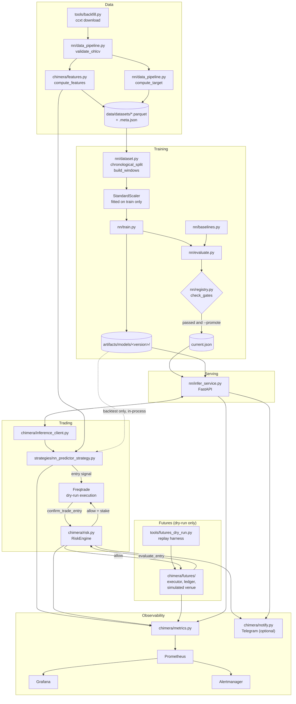

# Architecture

This describes the code as it is, not as it is intended to become.

## Boundaries

The system has one exchange-facing execution engine (Freqtrade) and a strict
rule about who may do what:

- **ML code never places orders.** Nothing under `nn/` imports an exchange
  client for trading, opens a position, or manages one. The inference service's
  only output is a probability vector.
- **The strategy never trains.** It consumes predictions; it does not fit
  anything. The one place it touches a model directly is offline backtesting,
  where it loads a frozen artifact read-only.
- **Every entry passes the risk engine.** `confirm_trade_entry` is the single
  gate on the Freqtrade path, and the dry-run futures executor asks the same
  engine before any order that increases exposure. It is a synchronous local
  check — no network call stands between a halted account and a blocked order.
- **`chimera/` never imports torch or freqtrade.** It is loaded in every
  container, so it stays light enough to be.

## Flow

```mermaid
flowchart TD
    subgraph Data
        BF["tools/backfill.py<br/>ccxt download"]
        VAL["nn/data_pipeline.py<br/>validate_ohlcv"]
        FEAT["chimera/features.py<br/>compute_features"]
        TGT["nn/data_pipeline.py<br/>compute_target"]
        DS[("data/datasets/*.parquet<br/>+ .meta.json")]
    end

    subgraph Training
        SPLIT["nn/dataset.py<br/>chronological_split<br/>build_windows"]
        SCALE["StandardScaler<br/>fitted on train only"]
        TRAIN["nn/train.py"]
        BASE["nn/baselines.py"]
        EVAL["nn/evaluate.py"]
        GATE{"nn/registry.py<br/>check_gates"}
        ART[("artifacts/models/&lt;version&gt;/")]
        CUR[("current.json")]
    end

    subgraph Serving
        SVC["nn/infer_service.py<br/>FastAPI"]
    end

    subgraph Trading
        CLIENT["chimera/inference_client.py"]
        STRAT["strategies/nn_predictor_strategy.py"]
        RISK["chimera/risk.py<br/>RiskEngine"]
        FT["Freqtrade<br/>dry-run execution"]
    end

    subgraph FuturesDryRun["Futures (dry-run only)"]
        HARN["tools/futures_dry_run.py<br/>replay harness"]
        FUT["chimera/futures/<br/>executor, ledger,<br/>simulated venue"]
    end

    subgraph Observability
        MET["chimera/metrics.py"]
        PROM["Prometheus"]
        GRAF["Grafana"]
        ALERT["Alertmanager"]
        TG["chimera/notify.py<br/>Telegram (optional)"]
    end

    BF --> VAL --> FEAT --> DS
    VAL --> TGT --> DS
    DS --> SPLIT --> SCALE --> TRAIN
    TRAIN --> EVAL
    BASE --> EVAL
    EVAL --> GATE
    TRAIN --> ART
    GATE -->|passed and --promote| CUR
    CUR --> SVC
    ART --> SVC
    SVC <--> CLIENT
    CLIENT --> STRAT
    FEAT --> STRAT
    STRAT -->|entry signal| FT
    FT -->|confirm_trade_entry| RISK
    RISK -->|allow + stake| FT
    HARN --> FUT
    FUT -->|evaluate_entry| RISK
    RISK -->|allow| FUT
    ART -.->|backtest only, in-process| STRAT
    STRAT --> MET
    RISK --> MET
    FUT --> MET
    SVC --> MET
    MET --> PROM --> GRAF
    PROM --> ALERT
    RISK --> TG
    SVC --> TG
```

## Components

### `chimera/` — the shared core

Imported by every other package and by every container. Contains no heavy
dependencies on purpose.

| Module | Responsibility |
| --- | --- |
| `features.py` | The definition of a feature vector. Causal, deterministic, fixed column order. |
| `contracts.py` | `Signal`, `TargetSpec`, `ModelMetadata`, and `decide()`. The shared vocabulary. |
| `risk.py` | `RiskEngine`: limits, sizing, kill switch. No Freqtrade dependency. |
| `safety.py` | The live-trading gate and environment validation. |
| `inference_client.py` | HTTP client with caching and fail-closed semantics. |
| `metrics.py` | Every Prometheus series the system exports. |
| `notify.py` | Optional Telegram, deduplicated and rate limited. |
| `futures/` | Dry-run USD-M perpetual execution: positions, order state machine, venue constraints, fees and funding. |

`features.py` being shared is the load-bearing decision: the training pipeline
and the live strategy call the *same function*, so a model cannot be served
inputs computed differently than the ones it learned from.

`futures/` is dry-run only. There is no live-order path:
`FuturesExecutionConfig(dry_run=False)` raises, and the only venue class in the
package simulates fills in this process. Every order it plans that increases
exposure passes `RiskEngine.evaluate_entry` first, so the boundary above holds
for it unchanged. Nothing in `strategies/` is wired to it today;
`tools/futures_dry_run.py` is what exercises it. The design, and the reasons
for it, are in [`futures_execution_v1.md`](futures_execution_v1.md).

### `nn/` — data, model, training, serving

| Module | Responsibility |
| --- | --- |
| `data_pipeline.py` | Download, validate, label, assemble and persist datasets. |
| `dataset.py` | Chronological splits, windowing, scaling. Where leakage is prevented. |
| `model_def.py` | `MTST`: a small configurable Transformer classifier. |
| `baselines.py` | Majority-class and momentum baselines the model must beat. |
| `train.py` | The training entrypoint. |
| `evaluate.py` | Classification and trading metrics; threshold selection. |
| `experiment.py` | Predeclared config grids, scored on validation only. |
| `walkforward.py` | Nested walk-forward *validation*: train -> inner validation (selection) -> outer validation (reported). |
| `wf_diagnostics.py` | Audits and compares completed walk-forward artifacts: integrity, comparability, seed stability. |
| `regime.py` | Dataset-backed statistics over an outer block's *scored* rows, timestamp-aligned raw OHLCV, and LONG/SHORT attribution. |
| `registry.py` | Artifact save/load, promotion gates, `current.json`. |
| `infer_service.py` | The FastAPI service. |

### `strategies/` — Freqtrade

`RiskAwareStrategy` (in `strategies/common/risk_manager.py`) is the base class.
It binds the risk engine to four Freqtrade callbacks, verified against the
installed version:

| Callback | What it does |
| --- | --- |
| `bot_loop_start` | Reads equity, updates drawdown and daily-loss state, publishes metrics. |
| `custom_stake_amount` | Risk-based sizing from the stop distance. |
| `confirm_trade_entry` | **The gate.** Returns False to block the order. |
| `order_filled` | Tracks exposure, loss streaks and the order rate. |

## Design decisions and why

### FastAPI instead of BentoML

The previous service loaded its model at import time from the BentoML store, so
the module could not be imported — or tested — without a populated store, and it
introduced a third model-versioning system alongside MLflow and the on-disk
artifacts. FastAPI and Pydantic are already in Freqtrade's dependency tree, give
schema validation and correct status codes directly, and let the entire contract
be exercised with `TestClient` against a tiny model. BentoML was not removed for
being disliked; it was removed because it made the service untestable and added a
redundant registry.

### The artifact directory, not a tracking server

`artifacts/models/<version>/` is the source of truth. A model loads with torch
and the standard library alone, so inference never depends on MLflow being
reachable. MLflow logging remains available behind `--mlflow` for experiment
tracking, which is what it is good at.

### Predictions in backtest come from a local model, not HTTP

Calling a service once per historical row is slow and dishonest — today's model
answering for a 2023 candle. In backtest and hyperopt the strategy loads a frozen
artifact and batches the dataframe through it in-process. Because features are
causal, batching introduces no look-ahead. Without a configured artifact the
strategy emits no signals and says so, instead of quietly backtesting something
else.

### The kill switch is local state

`RiskEngine.halted` is checked synchronously at the top of `evaluate_entry` and
persisted to disk so a restart does not clear it. The previous implementation
fired `requests.post("http://localhost:8080/api/v1/stop")` with no timeout and no
error handling and treated that as the guarantee — a guard that fails open
whenever the network does.

## What is deliberately absent

- No second engine that places orders. Freqtrade executes; `chimera/futures/`
  only simulates.
- No order placement from `nn/`.
- No live-capable path in CI.
- No metric on a dashboard that nothing exports.
